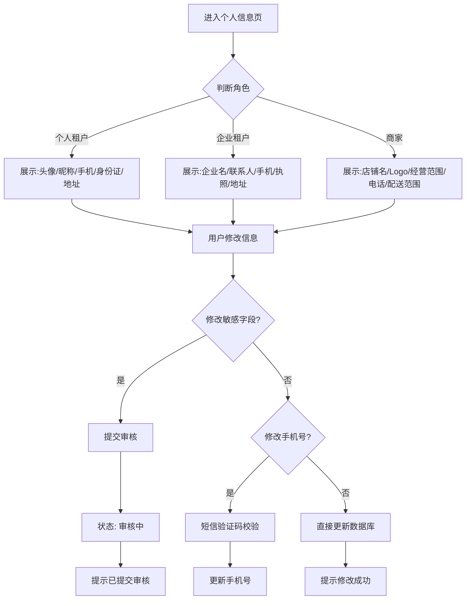

# 个人中心核心功能开发方案

## 一、 功能架构设计

本方案包含三个核心模块：**个人信息管理**、**购物车系统**、**商品/订单状态管理**。

### 1. 个人信息修改 (Profile Management)

**核心逻辑**：

* **差异化表单**：根据用户角色（个人租户/企业租户/商家）展示不同字段。

* **敏感信息审核**：修改身份证、营业执照等敏感信息时，不直接覆盖原数据，而是存入“待审核”状态，经管理员审核通过后生效。

* **安全验证**：修改手机号需经过短信验证码验证。

### 2. 购物车系统 (Shopping Cart)

**核心逻辑**：

* **库存预校验**：加入购物车时校验库存/租赁状态。

* **规格持久化**：保存用户选择的租赁时长、配送方式等参数。

* **状态同步**：商品若在购物车期间被租出/下架，需在购物车列表显式标记失效。

### 3. 商品/订单状态 (Status Tracking)

**核心逻辑**：

* **全流程状态机**：覆盖从“待付款”到“已完成/售后”的完整生命周期。

* **收藏夹**：简单的关注列表，支持按时间排序。

***

## 二、 详细交互与逻辑流程

### 1. 个人信息修改流程

### 2. 购物车操作流程

* **添加**：详情页 -> 选择规格 -> 校验库存 -> 写入`cart_items`表 -> 成功提示。

* **查看**：加载购物车列表 -> 校验每个商品的当前实时状态(是否失效) -> 渲染列表。

* **结算**：勾选商品 -> 点击结算 -> 跳转订单确认页(携带选中的购物车ID)。

### 3. 订单状态流转

* **待付款** (Wait Pay) -> **待确认** (Wait Confirm) -> **待交付/发货** (Wait Delivery) -> **待收货** (Delivered/Wait Receipt) -> **租赁中** (Renting) -> **待归还** (Wait Return) -> **已完成** (Completed)。

***

## 三、 数据库与接口设计

### 1. 数据库变更 (Entity Changes)

**User (新增字段)**

* `avatar` (String): 头像URL

* `address` (String): 地址

* `companyName` (String): 企业名称

* `contactPerson` (String): 联系人

* `businessScope` (String): 经营范围

* `deliveryRange` (String): 配送范围

* `pendingInfo` (Text/JSON): 存储待审核的修改信息 (JSON格式，避免宽表)

**CartItem (新增实体)**

* `id`: PK

* `userId`: FK

* `generatorId`: FK

* `leaseDuration`: Integer (租赁天数)

* `deliveryType`: Enum (配送/自提)

* `createdAt`: Timestamp

**Favorite (新增实体)**

* `id`: PK

* `userId`: FK

* `generatorId`: FK

* `createdAt`: Timestamp

### 2. 核心接口设计 (API Design)

| 模块      | 方法     | 路径                      | 描述      | 参数                        |
| :------ | :----- | :---------------------- | :------ | :------------------------ |
| **用户**  | GET    | `/api/user/profile`     | 获取个人信息  | Token                     |
| **用户**  | PUT    | `/api/user/profile`     | 修改信息    | JSON (含修改字段)              |
| **购物车** | GET    | `/api/cart`             | 获取购物车列表 | Token                     |
| **购物车** | POST   | `/api/cart/add`         | 添加商品    | `{generatorId, specs...}` |
| **购物车** | DELETE | `/api/cart/{id}`        | 删除/批量删除 | ID List                   |
| **收藏**  | POST   | `/api/favorites/toggle` | 收藏/取消收藏 | `{generatorId}`           |
| **收藏**  | GET    | `/api/favorites`        | 获取收藏列表  | Page, Size                |

***

## 四、 异常场景覆盖清单

1. **并发库存问题**：

   * *场景*：用户A加购物车时有货，结算时无货。

   * *处理*：购物车列表页实时检查状态，若失效显示“已失效”灰色不可点；结算时二次校验。

2. **敏感信息审核中再次修改**：

   * *场景*：用户提交了营业执照审核，审核未完成前再次尝试修改。

   * *处理*：前端禁用修改输入框，提示“审核中，请耐心等待”。

3. **验证码过期/错误**：

   * *场景*：修改手机号时验证码错误。

   * *处理*：后端返回 400 错误码及具体错误信息，前端不关闭弹窗，允许重试。

4. **数据同步**：

   * *场景*：多端登录。

   * *处理*：购物车数据存数据库，登录即同步。未登录状态本地存储（可选，本期建议优先实现登录后购物车）。

***

## 五、 开发实施步骤 (Plan)

1. **后端实体更新**：修改 `User`，创建 `CartItem`, `Favorite`。
2. **后端接口实现**：实现上述 API。
3. **前端页面开发**：

   * 新增 `UserProfile.vue` (含多角色表单切换)。

   * 新增 `Cart.vue`。

   * 新增 `Favorites.vue`。

   * 优化 `TenantOrders.vue` (增加状态筛选 tab)。
4. **联调与测试**：验证全流程。

