# 发电机租赁平台项目设计文档

本文档详细描述了发电机租赁平台的系统设计，包括用例图、业务流程图、功能模块设计、详细功能设计以及数据库设计。

## 一、系统用例图

本系统包含三种角色：租户、商家和管理员。以下是各角色的核心用例。

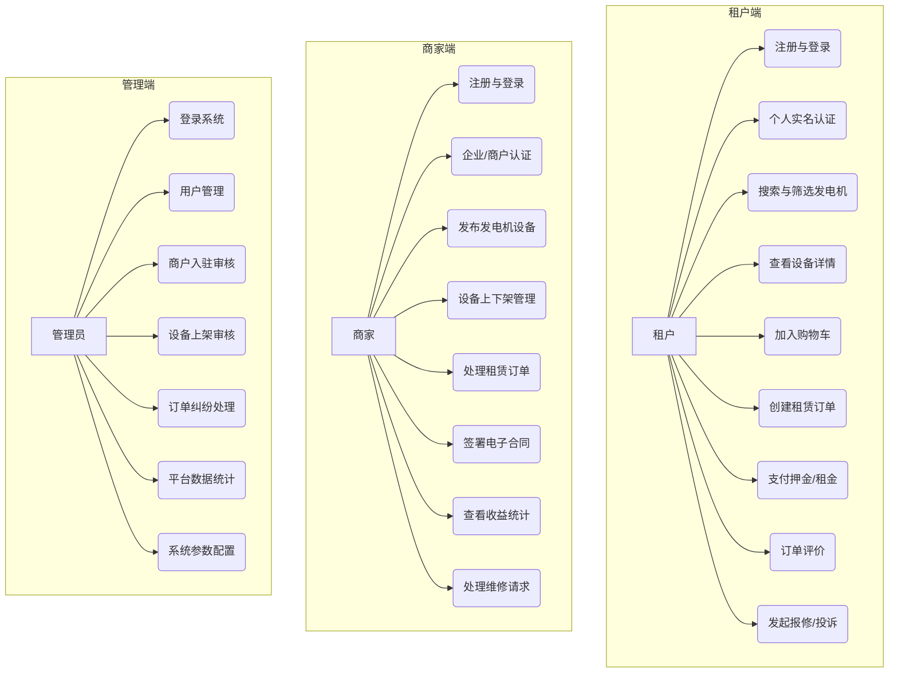

## 二、业务流程图

### 1. 核心租赁业务流程
描述了从租户下单到订单完成的完整闭环流程。

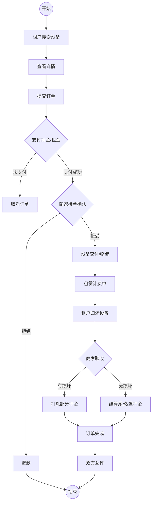

### 2. 商家入驻与审核流程

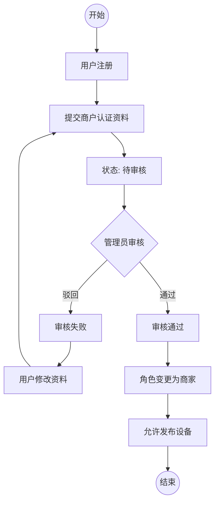

### 3. 系统运行流程图

描述了从用户操作到数据持久化的全链路交互流程。

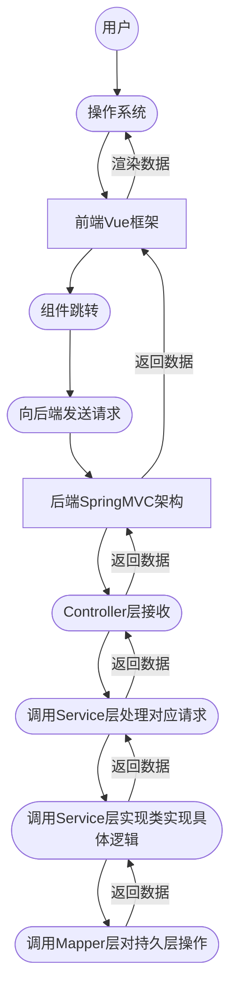

## 三、系统功能模块设计图

系统采用前后端分离架构，分为租户端、商家端和管理后台。

```mermaid
graph TD
    %% 根节点
    Root[发电机租赁平台]:::root

    %% 第一层分支
    Root --> Admin[后台管理系统]:::system
    Root --> Front[前台系统]:::system

    %% 后台管理系统分支
    Admin --> A_User[用户管理模块]:::module
    A_User --> A_UserList[用户列表]:::feature
    A_User --> A_RoleList[角色管理]:::feature
    A_User --> A_Audit[商户审核]:::feature

    Admin --> A_Order[订单管理模块]:::module
    A_Order --> A_OrderList[订单列表]:::feature
    A_Order --> A_Dispute[纠纷处理]:::feature
    A_Order --> A_Setting[订单设置]:::feature

    Admin --> A_Device[设备管理模块]:::module
    A_Device --> A_DeviceAudit[设备审核]:::feature
    A_Device --> A_Cat[设备分类]:::feature

    Admin --> A_Finance[财务管理模块]:::module
    A_Finance --> A_Flow[平台流水]:::feature
    A_Finance --> A_Withdraw[提现审核]:::feature

    %% 前台系统分支 (包含租户和商家)
    Front --> F_Public[公共服务]:::module
    F_Public --> F_Reg[注册/登录]:::feature
    F_Public --> F_Auth[实名认证]:::feature

    Front --> F_Tenant[租户功能]:::module
    F_Tenant --> F_Search[设备搜索]:::feature
    F_Tenant --> F_Cart[购物车]:::feature
    F_Tenant --> F_Rent[下单租赁]:::feature
    F_Tenant --> F_Comment[评价]:::feature

    Front --> F_Merchant[商家功能]:::module
    F_Merchant --> F_Publish[发布设备]:::feature
    F_Merchant --> F_MOrder[订单管理]:::feature
    F_Merchant --> F_Income[收益统计]:::feature
    
    %% 样式定义
    classDef root fill:#f96,stroke:#333,stroke-width:2px;
    classDef system fill:#6cf,stroke:#333,stroke-width:2px;
    classDef module fill:#9cf,stroke:#333,stroke-width:1px;
    classDef feature fill:#cdf,stroke:#333,stroke-width:1px;

```

## 四、系统功能详细设计

### 4.2.1 用户认证与权限管理功能流程
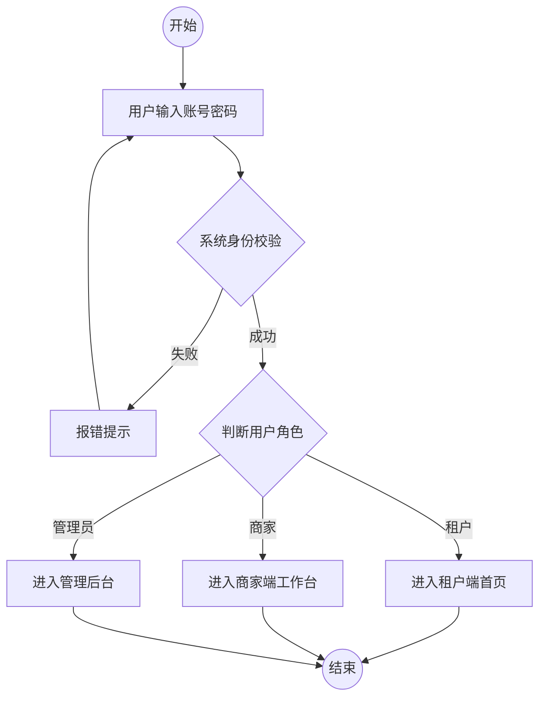

### 4.2.2 发电机搜索与展示功能流程
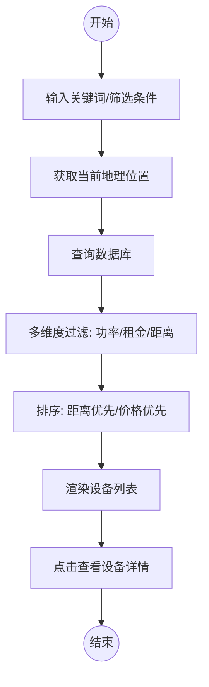

### 4.2.3 租赁订单流程功能
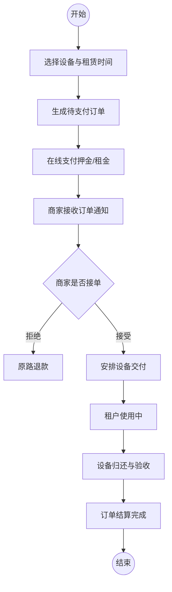

### 4.2.4 在线支付功能流程
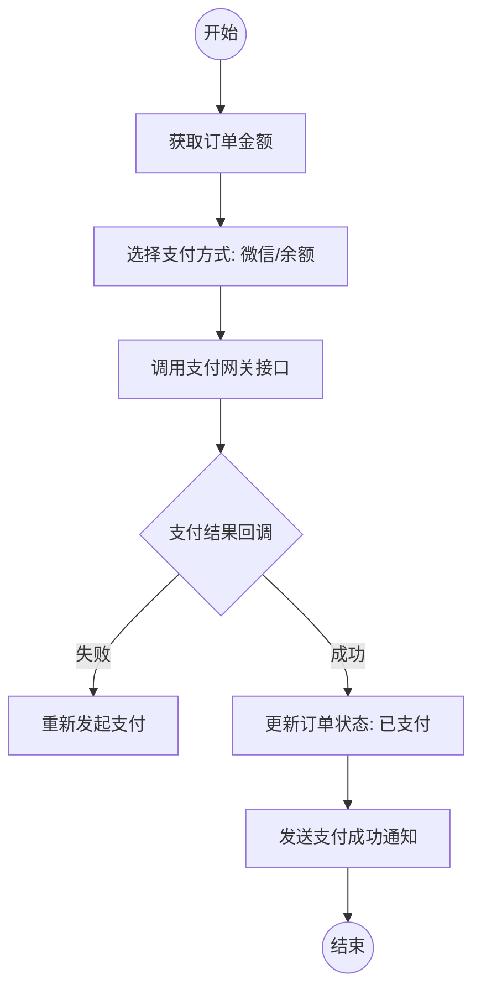

### 4.2.5 信用评价功能流程
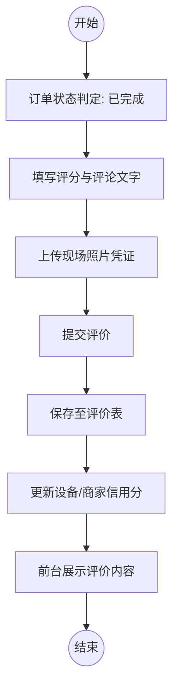

### 4.2.6 数据统计与分析功能流程
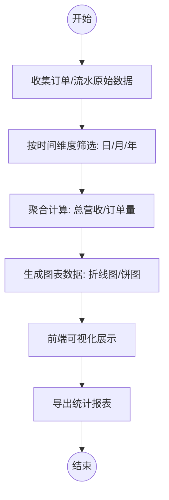

## 五、核心功能详细设计图 (旧版)

## 五、系统的 E-R 图与逻辑结构设计

### 1. 数据库逻辑结构设计

根据数据库表结构设计，核心表的逻辑结构如下（下划线表示主键）：

1.  **用户表 (users)**
    *   结构：(<u>用户id</u>、用户名、密码、手机号、角色、真实姓名、身份证号、营业执照号、头像、公司名称、审核状态)
    *   说明：存储所有角色的基础信息，角色字段区分租户(TENANT)、商家(MERCHANT)、管理员(ADMIN)。

2.  **发电机设备表 (generators)**
    *   结构：(<u>设备id</u>、商家id、设备名称、功率、燃油消耗、尺寸、重量、日租金、押金、库存状态、图片URL、地址、经纬度)
    *   外键：商家id 关联 **用户表** 的 用户id。

3.  **租赁订单表 (orders)**
    *   结构：(<u>订单id</u>、租户id、商家id、设备id、开始时间、结束时间、总金额、押金金额、订单状态、支付状态、配送地址、联系人)
    *   外键：租户id 关联 **用户表**；商家id 关联 **用户表**；设备id 关联 **发电机设备表**。

4.  **评价表 (reviews)**
    *   结构：(<u>评价id</u>、订单id、租户id、设备id、评分、评论内容、创建时间)
    *   外键：订单id 关联 **租赁订单表**；租户id 关联 **用户表**；设备id 关联 **发电机设备表**。

5.  **购物车表 (cart_items)**
    *   结构：(<u>购物车项id</u>、用户id、设备id、租赁时长、配送方式)
    *   外键：用户id 关联 **用户表**；设备id 关联 **发电机设备表**。

6.  **收藏表 (favorites)**
    *   结构：(<u>收藏id</u>、用户id、设备id、创建时间)
    *   外键：用户id 关联 **用户表**；设备id 关联 **发电机设备表**。

7.  **投诉/纠纷表 (complaints)**
    *   结构：(<u>投诉id</u>、订单id、原告id、被告id、投诉内容、处理状态、处理结果)
    *   外键：订单id 关联 **租赁订单表**；原告id/被告id 关联 **用户表**。

8.  **维修请求表 (repair_requests)**
    *   结构：(<u>请求id</u>、订单id、故障描述、图片凭证、处理状态、商家回复)
    *   外键：订单id 关联 **租赁订单表**。

### 2. 系统 E-R 图

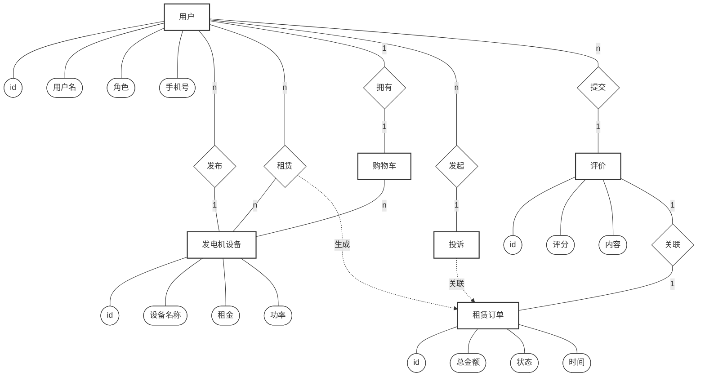
